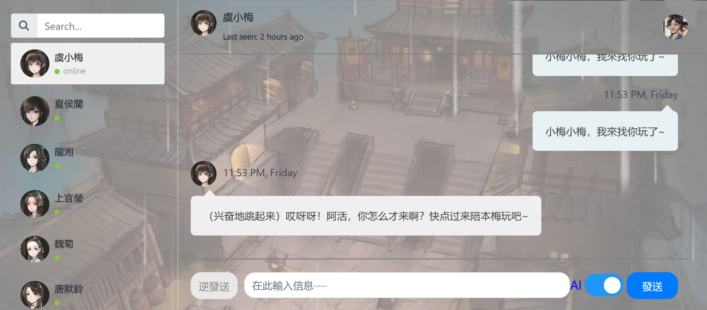

# What is this?
This is a simple chatroom web application that contains 8 characters from the game Legend of Mortal. It's also a side project gone side way just for fun. So please don't take this application seriously.

# How does it look like?

# What does this do?
It's a chatroom application that you can either talk to characters an write answers for yourself (which I do frequently), or you can install [Ollama](https://ollama.com), create a local model, add the model name to chatroom.properties and let the AI answer you.

# How do I open it?
It's a Spring web application. You download the released jar and run it with  
`` java -jar chatroom-v0.1.jar ``  
Then access it with `localhost:8080`.

# How do I set up Ollama?
// TODO write this

# What framework is used here?
- Spring, Spring Boot, Spring JPA, Spring AI. 
- Thymeleaf with native Javascript for AJAX.
- H2 Embeded DB is used for easy storage.
- Chatroom HTML template from [BootDey](https://www.bootdey.com/snippets/tagged/chat)

# TODO 
- [x] add AI as back end
- [x] add external property file for AI models